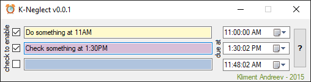

# K-Neglect

This is a simple daily reminder for things that has to happen in the next couple of hours. 
You can't schedule anything days in advance. Only 24 hrs and it can be the next day.

You have 3 reminders. Type a description, schedule a time and click the check on the left to enable.
Seconds are ignored. Minimum interval is 1 minute.
You can choose a date, but the program doesn't check the dates.
If you want to schedule something for tomorrow, schedule the time past.
E.g. If it's 3PM and you want scheduled something for tomorrow 8AM,
schedule the reminder for 8AM and leave the program running in the tray.

When the time comes, the program will pop-out from the tray.

# Download
You can download the exe from the releases section or compile on your own. 
Visual Studio and .NET 4.5 are required.

